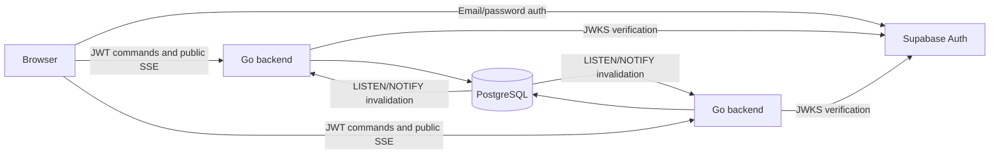

# Infrastructure and Runtime Guide

## Current architecture

PostgreSQL is the authoritative source for every active room. Go backend
instances are stateless with respect to game state and may be restarted or
scaled horizontally without losing or splitting rooms.



The backend follows context-first hexagonal architecture under
`backend/internal/room`:

- `domain`: room aggregate, game values, invariants, and validated rehydration.
- `application`: use cases and consumer-owned repository/event ports.
- `adapter/http`: HTTP/SSE transport and public DTO mapping.
- `adapter/postgres`: authoritative persistence, migrations, and cross-instance
  invalidation.
- `adapter/memory`: deterministic test adapter; never wired into runtime.

Dependencies point inward: adapters depend on application, and application
depends on domain. SQL, pgx, HTTP, and credential generation do not enter the
domain.

## Data consistency

Each mutation runs in one PostgreSQL transaction and locks the room row with
`SELECT ... FOR UPDATE`. Authentication, aggregate rehydration, domain
transition, relational persistence, revision increment, and `pg_notify` all
share that transaction. A failed command rolls back every effect. Database
primary keys, foreign keys, uniqueness constraints, and checks provide a second
line of invariant enforcement.

Supabase access tokens are Bearer credentials and establish account identity.
Create, join, session validation, and every mutation require a verified token.
Seat-owned operations additionally require the random 256-bit room credential
in `X-Room-Token`; PostgreSQL stores only its SHA-256 digest. A seat is bound to
the Supabase `sub`, while the random internal player identifier remains the game
identity. Public state and SSE expose none of these values.

Existing anonymous seat rows remain nullable after migration and cannot pass
account-bound authorization. The room schema intentionally has no foreign key to
`auth.users`: Supabase Auth validates identity, while avoiding that FK keeps the
authoritative room migrations reproducible in plain PostgreSQL integration tests.

`LISTEN/NOTIFY` is only an invalidation hint. Each SSE subscriber reloads the
latest committed snapshot from PostgreSQL and compares its monotonic revision.
Lost or coalesced notifications therefore cannot corrupt authoritative state;
an SSE reconnect always receives a fresh snapshot.

## Configuration and startup

| Variable | Required | Purpose |
|---|---:|---|
| `DATABASE_URL` | yes | pgx PostgreSQL connection string |
| `SUPABASE_URL` | yes | Supabase HTTPS project origin and JWT issuer base |
| `SUPABASE_JWT_AUDIENCE` | no | Expected JWT audience; defaults to `authenticated` |
| `PORT` | no | HTTP port; defaults to `8080` |
| `TEST_DATABASE_URL` | tests only | Enables destructive integration tests against a dedicated database |

The frontend requires `VITE_SUPABASE_URL` and
`VITE_SUPABASE_PUBLISHABLE_KEY`. These are browser-safe project values. Never
expose `DATABASE_URL`, database credentials, or a service-role secret through a
`VITE_` variable.

Supabase Auth must use an asymmetric ES256 or RS256 signing key. The backend
fetches public keys from `/auth/v1/.well-known/jwks.json`, caches them for ten
minutes, and refreshes immediately when a token references an unknown key ID.
Legacy shared-secret HS256 tokens are intentionally rejected. Configure the
Supabase Site URL and allowed redirect URLs for the deployed frontend origin so
email-confirmation links return to the application.

For Supabase-hosted PostgreSQL, configure the direct `DATABASE_URL` and include
`sslmode=require`. Direct connections fit the persistent Go process and preserve
session-level `LISTEN/NOTIFY`; the transaction pooler does not. Direct access may
require IPv6 (or Supabase's IPv4 option). Supavisor session mode on port 5432 is
the fallback when direct networking is unavailable.

At startup the server configures and pings the pool, then applies embedded SQL
migrations. Migration execution uses a transaction-scoped advisory lock, so
concurrent backend startups cannot race. Applied filenames are recorded in
`room_schema_migrations`.

Supabase project SQL for `public.users`, the `auth.users` synchronization trigger,
and self-read RLS was configured separately and is not owned or repeated here.

For local commands, see `README.md` and `backend/.env.example`. The provided
`compose.yaml` contains development-only credentials and persistent local data;
it is not a production deployment manifest.

## Operations

- `GET /api/health`: process liveness only; it does not claim dependencies are
  healthy.
- `GET /api/ready`: PostgreSQL and notification-listener readiness; returns
  `503` when the required database cannot be reached or the dedicated LISTEN
  connection is reconnecting.
- Shutdown on `SIGINT`/`SIGTERM` stops accepting HTTP traffic, drains requests
  for up to ten seconds, cancels the dedicated notification listener, and then
  closes the pool.
- The notification listener owns an acquired pool connection while listening,
  reconnects with bounded exponential backoff, and exits on cancellation.
- Listener readiness changes when pgx reports a connection failure. Detection
  of a silent half-open network connection can therefore lag until the socket
  or PostgreSQL driver surfaces that failure.

Production still needs managed TLS, backups with tested restores, connection
limits sized for backend replicas plus listeners, metrics/alerts, room retention
policy, abuse controls, and deployment-specific SSE proxy settings (buffering
disabled and sufficiently long stream timeouts).

## Verification

```bash
cd backend
go test -short ./...
TEST_DATABASE_URL='postgres://...' go test ./internal/room/adapter/postgres
go test ./...
```

Integration tests truncate room tables and MUST use an isolated test database.
They cover reconstruction after repository recreation, concurrent mutations,
duplicate protection, digest-only credentials, revisions, and cross-instance
notifications.
