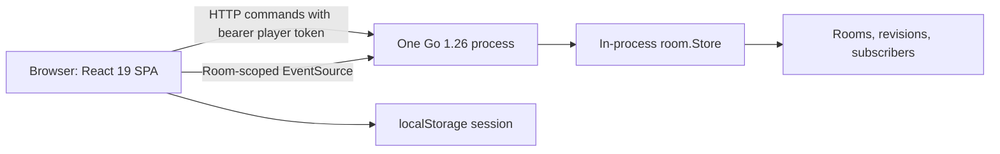
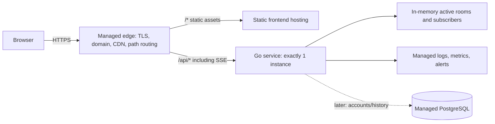

# Infrastructure and Deployment Decision Guide

> **Recommendation:** deploy the existing Go backend as **one continuously running instance**, publish the Vite build through static hosting/CDN, and route `/api/*` to that backend over the same public origin. Do not add Lambda functions for room mutations, and do not run multiple backend replicas yet. The current room state, synchronization lock, revision counter, and SSE subscriber registry all live inside one Go process; one process must therefore own every room from creation through closure.

This is the lowest-risk MVP architecture and intentionally accepts that a backend restart or deployment ends active rooms. Add managed PostgreSQL when accounts or history become product requirements. Externalize active-room coordination only when measured load or availability requirements justify multiple backend instances.

**Validated against the repository and linked official documentation on 2026-09-07.** The current-state section is confirmed; recommendations and future paths are projected.

## Decision summary

| Concern | Decision now | Trigger to revisit |
|---|---|---|
| Backend compute | One always-on Go web-service instance | One instance cannot meet measured connection/CPU/memory demand, or room survival across deploys becomes required |
| Frontend | Managed static hosting and CDN | Only reconsider if server-side rendering becomes a product requirement |
| Active rooms | Keep in process; treat them as ephemeral | Multiple backend instances, restart survival, or stricter availability is required |
| Durable data | None for the guest MVP | Accounts, game history, moderation, analytics source data, or billing is required |
| Future database | Managed PostgreSQL for users, identities, and history | Add when durable product data exists—not merely because deployment begins |
| Authentication | Current cryptographic guest player tokens | Add managed OIDC authentication when persistent accounts provide user value |
| Realtime | Keep room-scoped SSE snapshots | Change only if bidirectional realtime or a serverless redesign warrants WebSockets/subscriptions |
| Infrastructure style | Managed PaaS/SaaS before raw VMs or Kubernetes | Use IaaS only for a demonstrated platform limitation or a team with operational capacity |

## Verified current architecture

### Runtime and request model

| Area | Confirmed implementation | Deployment implication |
|---|---|---|
| Backend | Go standard-library `net/http`; no third-party Go dependencies | Small, portable binary suitable for a managed web-service/container platform |
| Process state | `main` creates one `room.Store`; its rooms map exists only in memory | Restarting or replacing the process loses every room and invalidates saved browser sessions |
| Concurrency | One `sync.RWMutex` serializes mutations and protects all rooms, revisions, and subscriptions | Correct inside one process, but it provides no synchronization across processes; the global lock may eventually limit throughput |
| HTTP API | Health, create, join, state, session validation, move, next-round, and leave routes | Commands are ordinary request/response HTTP and can remain in the monolith |
| Player identity | Create/join returns a 32-byte cryptographically random token; protected commands use it as a bearer token | This is capability-based guest access, not an account system; possession equals authority |
| Public state | State and SSE expose role-based, privacy-filtered snapshots rather than player tokens or unresolved moves | Public room codes still permit observation of readiness/scores; decide whether that privacy model is acceptable |
| SSE | `GET /api/rooms/{code}/events` subscribes to an in-process room registry, sends an initial snapshot, then revisioned updates and 15-second heartbeats | The connection and every mutation for that room must reach the process that owns the room |
| SSE timeout | The handler clears only its response write deadline and remains open until disconnect; other requests retain finite server timeouts | The hosting proxy must support streaming and timeouts longer than expected room sessions |
| Browser runtime | Native `fetch` and `EventSource` use relative `/api` URLs | Production needs same-origin path routing, or code/config changes plus an explicit CORS policy |
| Session restoration | Room code, player token, role, and frontend version are stored in `localStorage`; restoration is checked against the backend | Browser storage is convenience persistence only; it cannot restore a room after backend state loss |
| Frontend build | Vite builds static files; its `/api` proxy exists only in the development server | `vite.config.js` is not a production reverse proxy |
| Logging | Structured request logs include method, path, status, duration, and client IP; `/api/health` returns `ok` | Useful baseline, but not production observability or readiness |

### Missing production capabilities

The repository currently contains no database integration, shared cache/coordinator, durable room storage, account authentication, rate limiting, metrics, tracing, error reporting, secret/config loading, graceful shutdown, room expiry/garbage collection, deployment manifest/container definition, or CI/CD workflow. The server address is hard-coded to `0.0.0.0:8080` rather than reading the platform's port. No application TLS/domain configuration exists; that should normally be supplied by the hosting edge. There is no backup requirement until durable data is introduced, and no backup configuration today.

Also address these boundaries before public launch:

- Cap request-body sizes and apply per-IP/per-room rate limits to room creation, joins, validation, and commands.
- Define room TTL and cleanup. Closed and abandoned rooms currently remain in memory until process exit.
- Decide whether the SSE endpoint should remain accessible with only a room code. Native `EventSource` cannot attach the current bearer header; an authenticated stream would need a secure cookie, a short-lived stream ticket, or a different client/transport.
- Add proxy-aware client-IP handling only from trusted proxies; the current logger reads the direct peer address.
- Add graceful shutdown and deployment draining. With memory-owned rooms, even a graceful process exit still ends those rooms unless state is externalized.

## Service-model responsibilities

These classifications describe who operates each layer; they are not competing products.

| Model | Provider operates | Project/team still operates | Appropriate here |
|---|---|---|---|
| **IaaS** | Physical infrastructure, networking primitives, virtual machines | OS patching, runtime, process supervision, TLS/proxy setup, scaling, backups, monitoring, and application | Usually too much undifferentiated operations for this project. A single VM is viable but not preferred. |
| **PaaS** | Host OS, routing/TLS integration, deployment, process restart, and often logs/autoscaling | Application correctness, data model, capacity settings, secrets, migrations, monitoring policy, and incident response | **Preferred compute model** for the Go service and static frontend. Disable or cap autoscaling at one backend instance for now. |
| **SaaS** | A complete managed capability, such as identity, PostgreSQL, Redis, error tracking, or CI runners | Configuration, access policy, data governance, integration, spend, and vendor risk | Prefer selectively when the capability becomes necessary. Managed does not remove ownership of backup/restore tests or security configuration. |

## Recommended target architecture now

### Component responsibilities

- **Edge/static platform:** terminate TLS, serve immutable hashed assets, redirect HTTP to HTTPS, apply security headers, and proxy `/api/*` without buffering SSE. Keep one browser origin to preserve the current relative URLs and avoid premature CORS complexity.
- **Go service:** own room lifecycle, validate player capabilities, serialize game commands, emit snapshots, and expose health/readiness. Run exactly one application instance and one active revision.
- **In-memory store:** remain authoritative for ephemeral rooms. Set explicit room and inactivity TTLs before launch; publish a user-facing expectation that maintenance can close games.
- **Managed observability:** collect stdout/stderr logs, uptime checks, resource metrics, and alerts. This is operational state, not game state.
- **Managed PostgreSQL (later):** become the source of truth for accounts, identity links, completed-game history, moderation/audit records, and other durable product data. Do not put active rooms there until a durability or multi-instance requirement calls for it.

### Request and event flows

1. The edge serves the Vite SPA from CDN cache.
2. Create/join requests reach the single Go process, which creates or mutates an in-memory room and returns a room code plus player capability token.
3. The browser stores that guest session locally, validates it after reload, and opens room SSE through the same `/api` route.
4. The backend registers the SSE subscriber in that room's in-process registry and sends the current revisioned snapshot.
5. A command with a bearer player token mutates the room under the store lock. The backend increments the revision and notifies local subscribers; each stream reads and emits the latest privacy-safe snapshot.
6. On disconnect, native `EventSource` reconnects. The current server sends a fresh initial snapshot; it does not replay an event log or process `Last-Event-ID`.

### Provider examples, not commitments

| Need | Representative example | Fit and caution |
|---|---|---|
| Simple early-production PaaS | Render web service plus static site | Git-driven deploys, managed TLS/domain, health checks, logs, and static CDN reduce operations. Configure the backend port, use a paid/always-running service for live rooms, verify SSE proxy behavior, and prevent multiple active instances/revisions from splitting room ownership. |
| Autoscaling container PaaS | Google Cloud Run service plus static object/CDN hosting | Good once the app is containerized and state is external. Request timeouts can reach 60 minutes, but reconnects are expected and are not guaranteed to hit the same instance; set minimum/maximum instances deliberately. It is unsafe for the current memory-owned rooms if it scales beyond one instance. |
| Raw VM IaaS | Any mainstream cloud VM behind managed TLS/load balancing | Maximum control and predictable process lifetime, but the team owns patching, hardening, supervision, deploy rollback, and monitoring. Choose only if PaaS limits are proven blockers. |

Qualitatively, the recommended path has **low fixed cost and low operational complexity**: one small continuously allocated backend plus inexpensive static delivery and log retention. Avoid free tiers that sleep or terminate long requests; they are poor matches for live SSE even if they are adequate for demos.

## Why not one session server plus Lambdas?

That split creates two writers without creating a shared authority.

- **Stateful ownership:** the session server's rooms are ordinary Go objects. A Lambda invocation cannot safely mutate those objects; it can only call the owner over a network API or mutate a separate external store.
- **Concurrency:** the Go mutex protects one address space only. Concurrent Lambdas can read the same room version and both write incompatible outcomes unless every mutation uses an external transaction, conditional write, or single-writer coordinator.
- **SSE affinity:** subscribers are channels registered inside the owning Go process. A Lambda that changes external data cannot notify those channels without a shared event bus and fan-out consumer. Load-balancer stickiness alone does not make state shared and can route commands differently from SSE connections.
- **Split brain and races:** if both the session server and Lambdas can update a room, retries, delayed events, duplicate invocations, and partial failures can reorder moves or revisions. Defining ownership, idempotency, and conflict handling becomes harder than keeping the current command handlers together.
- **Operational complexity:** the split adds IAM, network calls, schemas, retries, dead-letter handling, tracing across services, deployments, and more failure modes while retaining the stateful server as a required bottleneck.

Lambda is designed for short-lived work that does not rely on retained state between invocations, and an invocation is bounded in duration. Moving the existing handlers there would be a redesign with extra coordination—not a simple scaling step.

**Corrected serverless variant:** make the functions stateless and make an external system authoritative. For example, HTTP API Gateway invokes Lambda commands; DynamoDB stores one versioned room aggregate and uses conditional writes/transactions for atomic state transitions; successful mutations publish an event; API Gateway WebSocket connections are indexed by room; a fan-out function sends the latest authorized snapshot through the `@connections` API. Every command requires an idempotency key and expected room version. This removes the in-memory session server entirely and changes the frontend realtime transport or introduces a managed subscription service.

## Viable evolution paths

### A. Long-running Go monolith — recommended now

**Choose when:** validating the product, serving modest traffic, and accepting that deploys/restarts end active rooms.

- One PaaS instance owns HTTP commands, active rooms, and SSE.
- Static frontend uses CDN hosting and same-origin `/api` routing.
- Add managed PostgreSQL only for durable users/history; keep rooms in memory.
- **Tradeoff:** simplest and cheapest to operate, but no room continuity through backend failure and no safe horizontal scaling.

### B. Multi-instance container platform with external coordination

**Choose when:** one instance reaches a measured capacity limit, deploys must not end rooms, or availability objectives require replicas.

- Containerized Go replicas become stateless request/SSE gateways.
- Managed PostgreSQL remains authoritative for durable relational data.
- Store active room aggregates in managed Redis or an equivalent low-latency coordinator. Perform each room transition atomically with optimistic versions or server-side transactions; never use uncoordinated read-modify-write.
- Publish room invalidations/events through shared pub/sub. Any SSE replica subscribes, reads the latest authoritative snapshot, and emits monotonically versioned updates. A reconnect always gets the current snapshot; durable replay can be added only if product semantics require every intermediate event.
- Use idempotency keys for commands and make event consumers duplicate-safe. Test coordinator failure, lost pub/sub messages, stale writes, and rolling deployments.
- **Tradeoff:** horizontal scale and restart tolerance, but materially higher cost, data-model complexity, and incident surface. Redis persistence and failover semantics must be chosen explicitly; a cache is not automatically a durable source of truth.

At lower scale, PostgreSQL transactions plus a notification mechanism can avoid a separate coordinator, but notification delivery alone is not durable. Always recover by reading current state from the source of truth.

### C. Truly serverless/event-driven redesign

**Choose when:** traffic is highly bursty, the team accepts an event-driven rewrite, and managed per-request infrastructure is more valuable than preserving the Go server shape.

- Use stateless command functions, a transactionally updated room record, an event stream, and managed WebSocket/subscription delivery as described above.
- Enforce room consistency with a version precondition or a system that serializes commands by room key.
- Persist connection/subscription mappings externally; functions never own live connections or authoritative memory.
- **Tradeoff:** elastic scaling and reduced server operations, but more services, asynchronous debugging, retry/idempotency design, vendor coupling, and likely transport/API changes. It is not the MVP shortcut.

### D. Stateful edge objects

**Choose when:** room-per-entity single-writer semantics and geographically distributed realtime are central product requirements, and a platform-specific rewrite is acceptable.

- A representative example is one Cloudflare Durable Object per room. Its unique identity coordinates clients, colocated strongly consistent storage persists room state, and WebSocket hibernation supports realtime connections.
- **Tradeoff:** the model maps naturally to room ownership and avoids assembling locks plus pub/sub, but the current Go `net/http` service cannot be lifted unchanged into that runtime. Expect a substantial rewrite and strong vendor coupling.

## Data and authentication evolution

### Storage boundaries

| Data | Now | Later |
|---|---|---|
| Active room, moves, score, revision, subscribers | In-memory Go store; ephemeral | Redis/equivalent coordinated aggregate for replicas, or a serverless single-writer/conditional-write store |
| Guest player capability | Random bearer token in room memory and browser `localStorage` | Store only a cryptographic hash if persisted; add expiry, revocation, and rotation semantics |
| User profile and identity link | Not present | Managed PostgreSQL with constraints and migrations |
| Completed-game history | Not present | PostgreSQL append-oriented records written after resolution; define retention/privacy policy |
| Analytics/telemetry | Request logs only | Managed telemetry pipeline; avoid placing raw bearer tokens or unresolved moves in logs |

For managed PostgreSQL, select a service with automated backups, point-in-time recovery appropriate to the business requirement, encryption, connection limits/pooling, maintenance visibility, and tested restore procedures. Keep it in the same region as compute. A provider saying “automated backups” is not evidence that the application can restore successfully—test restores.

### Authentication path

1. **Guest MVP:** retain random room/player capabilities, require HTTPS, add expiry/room TTL and abuse controls, and never log tokens. This is authorization by possession, not verified human identity.
2. **Accounts become valuable:** integrate a managed OIDC/OAuth 2.0 identity SaaS; validate issuer, audience, signature, and expiry in the backend; map the stable provider subject to an internal PostgreSQL user. Keep game authorization separate from login.
3. **Higher-risk features:** add account recovery policy, MFA where appropriate, session revocation, audit trails, privacy deletion/export, and administrative authorization.

## Failure, scaling, and deployment rules

| Failure or pressure | Current effect | Required response |
|---|---|---|
| Backend restart/crash/deploy | All rooms disappear; SSE reconnects receive `404`; saved sessions become invalid | Accept and communicate for MVP, deploy during low use, then externalize room state before promising continuity |
| Two backend instances | Each has different rooms/subscribers; requests can return false `404`s or diverge | **Do not scale horizontally** until state and event distribution are shared |
| SSE proxy timeout or network loss | Browser reconnects; the new stream receives a fresh snapshot | Configure streaming/no buffering and realistic timeouts; monitor reconnect rate; keep heartbeats |
| Slow SSE client | Current coalesced channel avoids blocking mutations and sends latest state | Preserve this property in any shared fan-out design |
| Process memory growth | Abandoned/closed rooms and subscribers consume resources until disconnect/process exit | Add TTL cleanup and metrics before meaningful public traffic |
| Global store-lock contention | Room mutations across all rooms serialize | Measure lock/command latency before redesigning; shard or externalize only on evidence |
| Duplicate/retried command | Some current operations return conflicts; there is no general idempotency contract | Add command IDs/version preconditions before introducing queues/functions or automatic retries |
| Region/platform outage | Game is unavailable | Start with one region; add recovery objectives and multi-region design only when business impact justifies consistency complexity |

### Explicit decision triggers

- **Add PostgreSQL:** persistent users, history, audit/moderation, or monetization enters scope.
- **Externalize active rooms:** deploys must preserve games, more than one instance is required, or measured room/connection load approaches safe single-instance capacity.
- **Add Redis/shared coordinator:** replicas need low-latency room state plus cross-instance event fan-out; do not add it merely as a cache.
- **Adopt managed OIDC:** users need accounts, cross-device identity, recovery, ownership, or moderation.
- **Change SSE:** clients need bidirectional server transport, the chosen platform cannot support required stream lifetimes, or serverless fan-out makes WebSockets/subscriptions operationally simpler.
- **Consider multi-region:** measured latency or a written recovery objective cannot be met in one region. First define conflict and room-ownership semantics.

## Security and observability baseline

### Security

- Managed TLS with automatic renewal; HTTPS-only redirects and HSTS after domain validation.
- Same-origin API routing; explicit allowlist if CORS is later required. Never use wildcard origins with credentials.
- CSP, `X-Content-Type-Options`, `Referrer-Policy`, and frame restrictions appropriate to the UI.
- Strict body-size/input limits, rate limiting, abuse monitoring, and bounded room creation.
- Secrets in the platform secret manager, separate per environment; no secrets in Vite client variables or repository files.
- Least-privilege service identity and database role; private database/coordinator networking where available.
- Dependency and container scanning, pinned reproducible builds, protected production deploys, and rollback procedure.
- Token redaction in logs and error reports. Review the privacy exposure of public room-code state/SSE.

### Observability

- Preserve structured request logs and add request/correlation ID, deployment version, route template, and trusted proxy metadata. Do not log authorization headers.
- Track HTTP rate/error/latency, active rooms, room age, active SSE connections, reconnects, event-send failures, process memory/CPU, and store-lock/command latency.
- Use separate liveness and readiness behavior. Readiness should fail during draining and when required external dependencies are unavailable.
- Alert first on user-visible symptoms: health failure, elevated command errors/latency, SSE disconnect spikes, and resource saturation.
- Add distributed tracing when external database/coordinator/functions create meaningful cross-service paths—not before.
- Define retention and sampling so telemetry cost remains proportional to product value.

## First deployment checklist

### Application prerequisites

- [ ] Make the backend listen on the platform-provided `PORT`, with `8080` as a local default.
- [ ] Add graceful shutdown, readiness/draining, room TTL cleanup, request-body limits, and basic rate limiting.
- [ ] Verify production builds: `go test ./...`, `npm test`, `npm run lint`, and `npm run build`.
- [ ] Decide and document that a backend deploy/restart closes all active rooms.
- [ ] Add build/deploy definitions and CI gates in a separate implementation change.

### Platform setup

- [ ] Provision one always-running backend instance; set both minimum and maximum instances to one and disable overlapping active revisions where possible.
- [ ] Deploy `frontend/dist` to managed static hosting/CDN.
- [ ] Route same-origin `/api/*` to the backend, preserving streaming, disabling response buffering/cache for SSE, and allowing a connection lifetime suitable for a game.
- [ ] Configure domain, DNS, managed TLS, HTTPS redirect, and security headers.
- [ ] Configure health/readiness checks, centralized logs, resource/uptime metrics, alerts, and a spend budget.
- [ ] Run two-browser create/join/play/rematch/leave tests through the real public edge; hold an SSE connection beyond every proxy timeout candidate and verify reconnect recovery.
- [ ] Exercise rollback and confirm its expected room-loss behavior.

### Before wider public traffic

- [ ] Load-test realistic concurrent rooms and two SSE connections per active room; record safe single-instance limits.
- [ ] Add abuse controls and verify that tokens never appear in logs, analytics, URLs, or frontend build artifacts.
- [ ] Write a short incident/runbook covering restart, failed deploy, elevated reconnects, and capacity saturation.

## Deferred items and non-goals

- No Kubernetes, service mesh, multi-region active/active, event sourcing, or microservice split for the MVP.
- No PostgreSQL until durable product entities exist; no Redis until shared room coordination is required.
- No promise of room survival across deploys until active state is externalized and recovery is tested.
- No Lambda extraction of individual room commands while the Go process owns room state.
- No exact cost estimates: regions, plans, included usage, traffic, log retention, and provider pricing change. Compare current calculators using measured CPU, memory, egress, build minutes, database storage/connections, and concurrent realtime connections.

## Official references

Provider names below are examples, not required commitments.

- Go [`ResponseController.SetWriteDeadline`](https://pkg.go.dev/net/http#ResponseController.SetWriteDeadline)
- MDN [`EventSource`](https://developer.mozilla.org/en-US/docs/Web/API/EventSource) and [server-sent events](https://developer.mozilla.org/en-US/docs/Web/API/Server-sent_events)
- Vite [static deployment guide](https://vite.dev/guide/static-deploy.html)
- Render [web services](https://render.com/docs/web-services), [static sites](https://render.com/docs/static-sites), and [health checks](https://render.com/docs/health-checks)
- Google Cloud Run [request timeouts](https://cloud.google.com/run/docs/configuring/request-timeout), [WebSockets](https://cloud.google.com/run/docs/triggering/websockets), and [session affinity](https://cloud.google.com/run/docs/configuring/session-affinity)
- AWS Lambda [execution model](https://docs.aws.amazon.com/lambda/latest/dg/concepts-basics.html) and [quotas/time limits](https://docs.aws.amazon.com/lambda/latest/dg/gettingstarted-limits.html)
- Amazon API Gateway [WebSocket API overview](https://docs.aws.amazon.com/apigateway/latest/developerguide/apigateway-websocket-api-overview.html)
- Amazon DynamoDB [conditional update expressions](https://docs.aws.amazon.com/amazondynamodb/latest/developerguide/Expressions.ConditionExpressions.html) and [transactions](https://docs.aws.amazon.com/amazondynamodb/latest/developerguide/transactions.html)
- Cloudflare [Durable Objects](https://developers.cloudflare.com/durable-objects/) and [WebSocket hibernation](https://developers.cloudflare.com/durable-objects/best-practices/websockets/)
- PostgreSQL [transactions](https://www.postgresql.org/docs/current/tutorial-transactions.html), [constraints](https://www.postgresql.org/docs/current/ddl-constraints.html), and [`LISTEN`/`NOTIFY`](https://www.postgresql.org/docs/current/sql-notify.html)
- OpenID Foundation [OpenID Connect Core](https://openid.net/specs/openid-connect-core-1_0.html)
- OpenTelemetry [documentation](https://opentelemetry.io/docs/)
